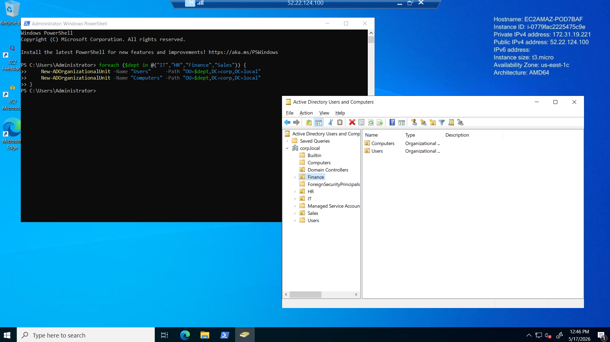
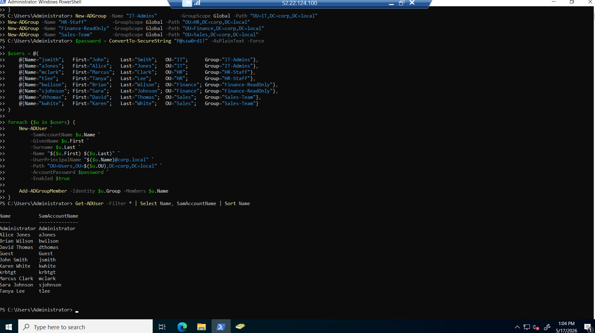
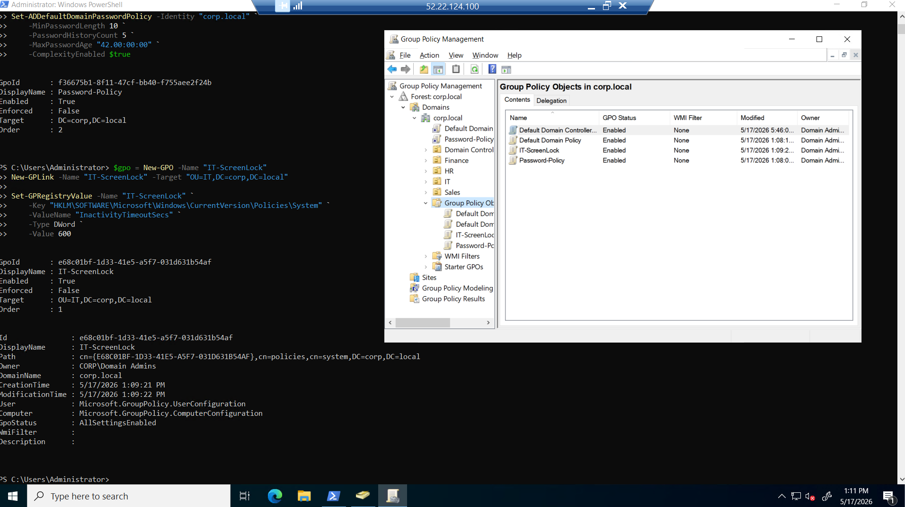
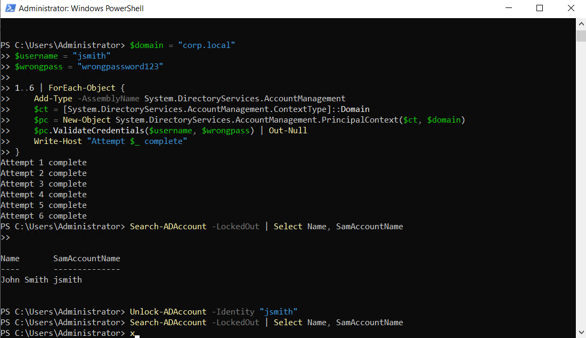

# Active Directory Homelab — Domain Controller & User Management

**Platform:** AWS EC2 · Windows Server 2022 · Active Directory · PowerShell  
**Year:** 2026  
**Focus:** Help desk administration, user lifecycle management, Group Policy, Tier 1 ticket simulation

---

## Overview

This lab simulates a real corporate IT environment built from scratch on AWS EC2. A Windows Server 2022 instance was promoted to a domain controller running the `corp.local` domain, with a full Active Directory structure mirroring a mid-size company. All Tier 1 help desk tasks were performed and documented using PowerShell and ADUC.

---

## Environment

| Component | Details |
|---|---|
| Cloud | AWS EC2 (t3.micro) |
| OS | Windows Server 2022 |
| Domain | corp.local |
| Authentication | Kerberos + DNS |
| Tools | Active Directory Users & Computers (ADUC), Group Policy Management Console (GPMC), PowerShell |

---

## What Was Built

### 1. Domain Controller Setup
- Deployed Windows Server 2022 on AWS EC2 with Elastic IP
- Installed AD DS role and promoted server to domain controller
- Configured `corp.local` forest with integrated DNS
- Set static private IP and pointed DNS to localhost (127.0.0.1)

```powershell
Install-WindowsFeature AD-Domain-Services -IncludeManagementTools
Install-ADDSForest -DomainName "corp.local" -DomainNetBiosName "CORP" -InstallDns:$true
```

---

### 2. OU Structure
Built a 4-department organizational unit hierarchy with Users and Computers sub-OUs inside each department, mirroring real enterprise AD design.

```
corp.local
├── IT
│   ├── Users
│   └── Computers
├── HR
│   ├── Users
│   └── Computers
├── Finance
│   ├── Users
│   └── Computers
└── Sales
    ├── Users
    └── Computers
```

```powershell
foreach ($dept in @("IT","HR","Finance","Sales")) {
    New-ADOrganizationalUnit -Name "Users"     -Path "OU=$dept,DC=corp,DC=local"
    New-ADOrganizationalUnit -Name "Computers" -Path "OU=$dept,DC=corp,DC=local"
}
```

**Screenshot — ADUC showing full OU tree:**



---

### 3. Users & Security Groups
Created 4 security groups and 8 domain user accounts distributed across departments. Users were bulk-created via PowerShell and automatically added to their department group.

| User | Department | Group |
|---|---|---|
| jsmith | IT | IT-Admins |
| aJones | IT | IT-Admins |
| mclark | HR | HR-Staff |
| tlee | HR | HR-Staff |
| bwilson | Finance | Finance-ReadOnly |
| sjohnson | Finance | Finance-ReadOnly |
| dthomas | Sales | Sales-Team |
| kwhite | Sales | Sales-Team |

```powershell
New-ADGroup -Name "IT-Admins"        -GroupScope Global -Path "OU=IT,DC=corp,DC=local"
New-ADGroup -Name "HR-Staff"         -GroupScope Global -Path "OU=HR,DC=corp,DC=local"
New-ADGroup -Name "Finance-ReadOnly" -GroupScope Global -Path "OU=Finance,DC=corp,DC=local"
New-ADGroup -Name "Sales-Team"       -GroupScope Global -Path "OU=Sales,DC=corp,DC=local"
```

**Screenshot — PowerShell output confirming all 8 users created:**



---

### 4. Group Policy Objects (GPOs)
Created and linked two GPOs to enforce security policy across the domain and IT department.

| GPO | Scope | Policy |
|---|---|---|
| Password-Policy | Domain-wide | Min 10 chars, complexity enabled, 42-day max age, 5-password history |
| IT-ScreenLock | IT OU only | Screen lock after 600 seconds (10 min) of inactivity |

```powershell
# Password policy
Set-ADDefaultDomainPasswordPolicy -Identity "corp.local" `
    -MinPasswordLength 10 `
    -PasswordHistoryCount 5 `
    -MaxPasswordAge "42.00:00:00" `
    -ComplexityEnabled $true

# Screen lock GPO linked to IT OU
$gpo = New-GPO -Name "IT-ScreenLock"
New-GPLink -Name "IT-ScreenLock" -Target "OU=IT,DC=corp,DC=local"
Set-GPRegistryValue -Name "IT-ScreenLock" `
    -Key "HKLM\SOFTWARE\Microsoft\Windows\CurrentVersion\Policies\System" `
    -ValueName "InactivityTimeoutSecs" -Type DWord -Value 600
```

**Screenshot — GPMC showing both GPOs linked and enabled:**



---

### 5. Tier 1 Help Desk Task Simulations

Each task below mirrors a real help desk ticket. PowerShell output and ADUC screenshots document every action.

#### Account Lockout & Unlock
Simulated 6 failed authentication attempts against `jsmith` using .NET credential validation, triggering the domain lockout policy. Verified lockout with `Search-ADAccount`, then resolved with `Unlock-ADAccount`.

```powershell
# Simulate failed logins
1..6 | ForEach-Object {
    $pc = New-Object System.DirectoryServices.AccountManagement.PrincipalContext(
        [System.DirectoryServices.AccountManagement.ContextType]::Domain, "corp.local")
    $pc.ValidateCredentials("jsmith", "wrongpassword123") | Out-Null
}

# Verify lockout
Search-ADAccount -LockedOut | Select Name, SamAccountName

# Resolve — unlock account
Unlock-ADAccount -Identity "jsmith"
```

**Screenshot — lockout confirmed, unlock executed, account cleared:**



#### Password Reset
```powershell
Set-ADAccountPassword -Identity "mclark" -Reset `
    -NewPassword (ConvertTo-SecureString "NewP@ss99!" -AsPlainText -Force)
Set-ADUser -Identity "mclark" -ChangePasswordAtLogon $true
```

#### User Disable (Offboarding)
```powershell
Disable-ADAccount -Identity "dthomas"
```

#### OU Migration (Department Transfer)
```powershell
Move-ADObject -Identity "CN=Karen White,OU=Users,OU=Sales,DC=corp,DC=local" `
              -TargetPath "OU=Users,OU=IT,DC=corp,DC=local"
```

---

## Screenshots

| File | What it shows |
|---|---|
| `Active_Directory_Users_and_Computers.png` | Full OU tree with all 4 departments and sub-OUs |
| `ADUsers.png` | PowerShell bulk user creation + Get-ADUser output confirming all 8 accounts |
| `Group_policy_objects.png` | GPMC with Password-Policy and IT-ScreenLock linked and enabled |
| `Unlocking_John.png` | jsmith lockout confirmed via Search-ADAccount, unlock executed, account cleared |

---

## Skills Demonstrated

- Active Directory Domain Services (AD DS) deployment and configuration
- Organizational Unit design and management
- Bulk user and group creation via PowerShell
- Group Policy Object creation, linking, and registry-based configuration
- Tier 1 ticket resolution: account unlocks, password resets, offboarding, OU migrations
- AWS EC2 provisioning and Windows Server administration
- Security group-based access control (no direct user permissions)
- Incident documentation and audit trail awareness (Event ID 4740)

---

## Key Concepts Learned

**Never delete — always disable.** Deleted AD accounts lose their SID, group memberships, and audit history. Disable first, move to a Disabled OU, wait for company policy window before permanent deletion.

**Groups, not direct permissions.** Every access grant goes through a security group. Direct user permissions are invisible to group audits and become orphaned when users leave.

**Verify identity before every reset.** Help desk is a primary social engineering attack vector. Identity verification before any account action is non-negotiable.

**GPO inheritance.** Policies applied at the domain level affect everyone. Policies applied at the OU level only affect that OU. Moving a user between OUs changes which policies apply to them.
